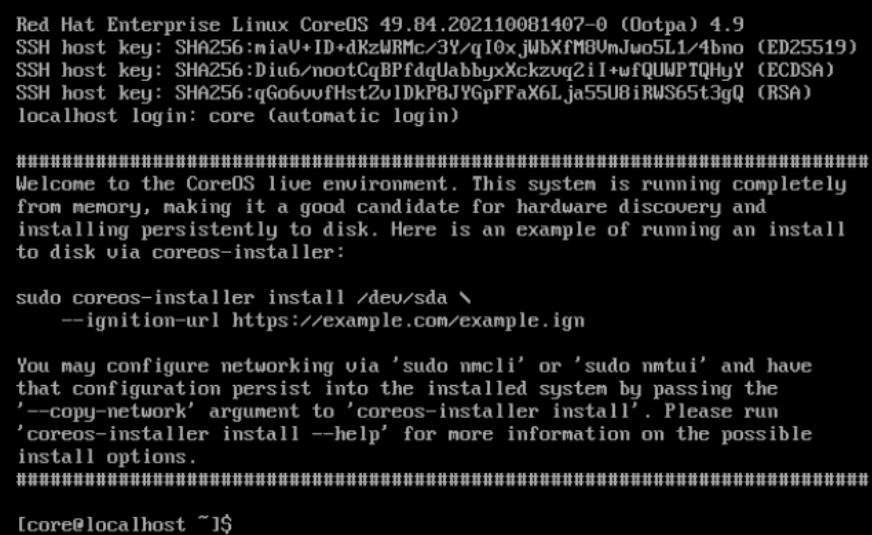
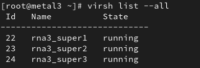
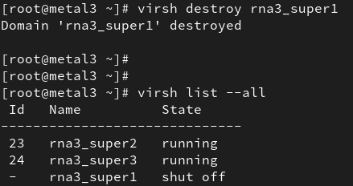
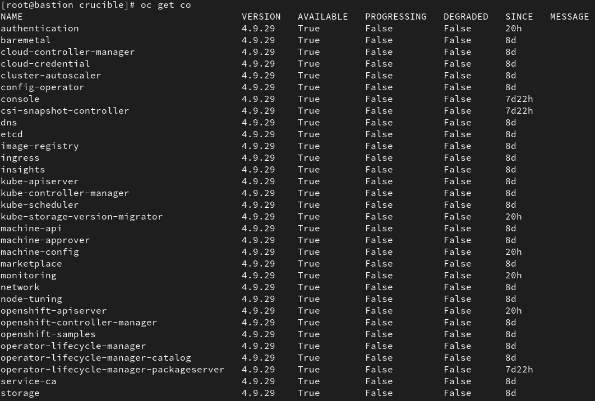
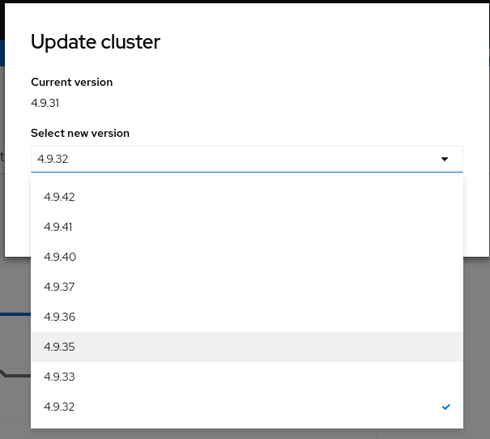

# Supervisor Node Replacement in Red Hat OpenShift Container Platform 4

## Introduction

This blog captures details to evaluate replacing a supervisor (control plane) node in Red Hat OpenShift 4.  It illustrates a use case of migrating from a virtual machine based supervisor node (hosted on a single Red Hat Enterprise Linux KVM hypervisor system) to a physical bare-metal system. 

This will be achieved by deploying a VM-based 3 supervisor node OpenShift cluster by using crucible automation. Once the cluster is up, workloads will be created on top of the cluster to demonstrate a functioning state. After this, the Ignition file from the supervisor nodes will be extracted and stored inside a HTTP server to be consumed by new bare metal nodes. Bare metal nodes will boot using the RHCOS image and with the use of these ignition files and by accepting some required CSR they will be added to the cluster. This documentation will also cover how to successfully decommission the nodes that are being relieved from their supervisor duties, how to ensure they no longer have ETCD membership and remove any secrets associated with them. Lastly, the documentation covers steps to perform a minor upgrade and all validation steps to ensure a successful replacement.

## OpenShift Container Platform Installation with Crucible

Crucible Automation is a set of playbooks for installing an OpenShift cluster on-premise using the developer preview version of the OpenShift Assisted Installer. Using Crucible, one can install and set up multiple OpenShift 4.9 clusters in a simplified automated way.

For our particular deployment, we need to ensure complete segregation of networks and using Crucible all the prerequisites for both OpenShift Clusters (DNS/DHCP/Bridging/VLANS) are set up with ease.

Clone Crucible repository using the commands below:
```
$ git clone https://github.com/redhat-partner-solutions/crucible
```

In order to use these playbooks to deploy OpenShift, the availability of a jump/bastion host (which can be virtual or physical) and a minimum of three target systems for the resulting cluster is required. These playbooks are intended to be run from the jump/bastion host that itself is subscribed to Red Hat Subscription Manager.

For this lab based deployment guide, we will try to create 1 clusters in total. Running the playbooks will deploy and set up a fully operational OpenShift cluster with control plane nodes deployed as virtual machines on top of each bare-metal server.

Each virtual machine for control plane nodes of OpenShift cluster should have the following minimum specifications:

**vCPU**: 6

**Memory**: 24GB

**Disk**: 120gb

When inventory files for our cluster is ready, we can start the crucible deployment with following:
```
ansible-playbook -i 2361inventory.yml site.yml -vv
```
When deployment finishes, we can see the GUI address, password, kubeconfig file in our assisted installer GUI. It is possible to reach Assisted Installer GUI from **http://<bastion_IP>:8080/clusters**


If you click on the cluster, you can see the details about that cluster.


After the deployment is completed, architecture of our system is like the following:


After replacement of the virtual supervisor nodes  are completed, architecture will be like following at the end:


## NFS Installation on Bastion Host

In order to create some workload on the OCP cluster, we will first NFS to our bastion host and create some workload on OCP using this NFS. So this step will be the installation of the NFS server packages on the RHEL/CentOS 8 system.
```
sudo yum -y install nfs-utils
```
Now create the directory that will be shared by NFS:
```
mkdir /var/nfsshare
```
Change the permissions of the folder as follows:
```
chmod -R 755 /var/nfsshare
chown nfsnobody:nfsnobody /var/nfsshare
```
After the installation, start and enable nfs-server service:
sudo systemctl enable --now nfs-server rpcbind
Next, we need to start the services and enable them to be started at boot time. 
```
systemctl enable rpcbind
systemctl enable nfs-server
systemctl enable nfs-lock
systemctl enable nfs-idmap
systemctl start rpcbind
systemctl start nfs-server
systemctl start nfs-lock
systemctl start nfs-idmap
```
Now we will share the NFS directory over the network a follows:
```
vi /etc/exports
/var/nfsshare   10.19.6.18(rw,sync,no_root_squash,no_all_squash)
/var/nfsshare    10.19.6.6(rw,sync,no_root_squash,no_all_squash)
/var/nfsshare    10.19.6.7(rw,sync,no_root_squash,no_all_squash)
/var/nfsshare    10.19.6.8(rw,sync,no_root_squash,no_all_squash)
```
Finally, start the NFS service:
```
systemctl restart nfs-server
```
Again we need to add the NFS service override in CentOS 7 firewall-cmd public zone service as:
```
firewall-cmd --permanent --zone=public --add-service=nfs
firewall-cmd --permanent --zone=public --add-service=mountd
firewall-cmd --permanent --zone=public --add-service=rpc-bind
firewall-cmd --reload
```

## Workload Deployment on OCP Cluster

In order to verify and check the functionality of OCP cluster before and after the master node replacement, we will create some workload on our cluster so we will deploy some deployments, persistent volumes and persistent volume claims on our OCP cluster using the NFS that we deployed on the previous steps.

The following are the yaml files for our deployments, persistent volumes and persistent volume claims:

## Deployment
```
oc create -f - <<EOF
apiVersion: apps/v1
kind: Deployment
metadata:
  name: hello-openshift
spec:
  replicas: 1
  selector:
    matchLabels:
      app: hello-openshift
  template:
    metadata:
      labels:
        app: hello-openshift
    spec:
      containers:
      - name: ceph-busybox
        image: quay.io/openshifttest/busybox
        command: ["sleep", "60000"]
        volumeMounts:
        - name: ceph-vol-test
          mountPath: /usr/share/busybox
          readOnly: false
      volumes:
      - name: ceph-vol-test
        persistentVolumeClaim:
          claimName: nfs-claim1
EOF
```
## Persistent Volume
```                  
oc create -f - <<EOF
apiVersion: v1
kind: PersistentVolume
metadata:
  name: pv0001 
spec:
  capacity:
    storage: 5Gi 
  accessModes:
  - ReadWriteOnce 
  nfs: 
    path: /var/nfsshare
    server: 10.19.6.21
  persistentVolumeReclaimPolicy: Retain 
EOF
```
## Persistent Volume Claim
```
oc create -f - <<EOF
apiVersion: v1
kind: PersistentVolumeClaim
metadata:
  name: nfs-claim1
spec:
  accessModes:
    - ReadWriteOnce 
  resources:
    requests:
      storage: 5Gi 
  volumeName: pv0001
  storageClassName: ""
EOF
```
## Extract the ignition for the control plane from the cluster

Once we have the cluster deployed with running workloads, we are ready to begin the process of migrating to physical supervisor machines.  First, we need to extract the ignition for the control plane servers (masters) to begin this process.  

Red Hat’s Knowledge Base Articles show how to do this.  To extract the ignition for the control place from the cluster.
https://access.redhat.com/solutions/5504291

Using 
```
oc extract -n openshift-machine-api secret/master-user-data --keys=userData --to= {/PATH}
```

We will extract the ignition file for the current state of the cluster, and save the ignition file to an HTTP server accessible location.
Once the ignition configuration has been extracted it should look similar to this example:
```
{"ignition":{"config":{"merge":[{"source":"https://10.19.6.1:22623/config/master"}]},"security":{"tls":{"certificateAuthorities":[{"source":""}]}}
```

The file will be saved as a userData file. Save this as a .ign file and store it on the http server.


# Replacing Supervisor RHCOS bare metal machines using an ISO image stored in HTTP Store

You can create more Red Hat Enterprise Linux CoreOS (RHCOS) compute machines for your cluster by using an ISO image to create the machines.

1. Boot the node with RHCOS ISO, or by using the boot ISO playbooks in Crucible.

Once you have boot the ISO on your BM machine and start the server, you will be prompted to an installer screen shown below:


2. In order to ensure the network configuration is set correctly we need to statically assign the IP address, gateway and dns on the BM supervisor node. Use nmcli commands mentioned below as an example:
```
nmcli connection show 
sudo nmcli con mod "Wired connection xyz" ipv4.method manual
sudo nmcli con mod "Wired connection xyz" ipv4.addresses "10.19.6.19/24"
nmcli con mod Wired\ connection\ xyz ipv4.gateway 10.19.6.254
nmcli con mod Wired\ connection\ xyz ipv4.dns 10.19.143.247
sudo nmcli con up "Wired connection xyz"
```
3. In order to configure persistent hostname when creating RHCOS in OpenShift 4.6 or later, Hostname can not persist while passing the --copy-network option to the coreos-installer command when creating RHCOS
The recommended way to configure the hostname would be to provide a unique Ignition config that writes out /etc/hostname with the desired value for the system during install time.

```
{"ignition":{"config":{"merge":[{"source":"https://10.19.6.1:22623/config/master"}]},"security":{"tls":{"certificateAuthorities":[{"source":"data:text/plain;charset=utf-8;base64,LS0tLS1CRUdJTiBDRVJUSUZJQ0FURS0tLS0tCk1JSUR…"}]}},"version":"3.2.0"},"storage":{"files":[{"path":"/etc/hostname","contents":{"source":"data:,metal2"},"mode":420}]}}
```

In the example, a storage section has been added to the Ignition config. This section instructs Ignition to write out /etc/hostname with the contents worker0.example.com

It is necessary to create modified Ignition configurations for each node of which the hostname needs to be configured and then make them available via HTTP or HTTPS.

4. After that save the master.ign file to an HTTP server accessible location. Your master.ign file should now  look similar to this with the storage section added:


5. In the CLI of the booted node, issue coreos-installer install --ignition-url <ignition> to pull the master.ign file from a http server and install Red Hat Enterprise Linux CoreOS on disk device /dev/sda:

```
sudo coreos-installer install /dev/sda --ignition-url http://10.19.6.21/discovery/master.ign --insecure-ignition --copy-network
```

  
After the installation of the RHCOS and network configuration completes, reboot the node.

6. We will be required to remove one of the existing Supervisor node from our OpenShift Cluster. The following commands below would be used:
```
oc delete node <node-name>
```


  
## Steps to remove ETCD membership
Check the status of the EtcdMembers Available status condition using the following command:
```
oc get etcd -o=jsonpath='{range .items[0].status.conditions[?(@.type=="EtcdMembersAvailable")]}{.message}{"\n"}'
```

### Removing the member:
In a terminal that has access to the cluster as a cluster-admin user, run the following command:
```
oc get pods -n openshift-etcd | grep -v etcd-quorum-guard | grep etcd
```


Connect to the running etcd container, passing in the name of a pod that is not on the removing node:
In a terminal that has access to the cluster as a cluster-admin user, run the following command:
```
oc rsh -n openshift-etcd etcd-super2
```


### View the member list:
```
sh-4.2# etcdctl member list -w table
```


### Remove the etcd member by providing the ID to the etcdctl member remove command:
```
etcdctl member remove 6fc1e7c9db35841d
etcdctl member list -w table
```


### Remove the old secrets for the etcd member that was removed:
List the secrets for the etcd member that was removed.
```
oc get secrets -n openshift-etcd | grep super1
```


### Delete the secrets for the etcd member that was removed:
#### Delete the peer secret:
```
oc delete secret -n openshift-etcd etcd-peer-ip-10-0-131-183.ec2.internal
```
#### Delete the serving secret:
```
oc delete secret -n openshift-etcd etcd-serving-ip-10-0-131-183.ec2.internal
```
#### Delete the metrics secret:
```
oc delete secret -n openshift-etcd etcd-serving-metrics-ip-10-0-131-183.ec2.internal
```


### Obtain the machine for the removed member:
In a terminal that has access to the cluster as a cluster-admin user, run the following command:
```
oc get machines -n openshift-machine-api -o wide
```


### Delete the machine of the member:
```
oc delete machine -n openshift-machine-api clustername-8qw5l-master-0 
```
### Verify that the machine was deleted:
```
oc get machines -n openshift-machine-api -o wide
```


Lastly, Ensure that the replaced node is in powered off and in shutdown mode.





## Approving the certificate signing requests for your machines
When you add machines to a cluster, two pending certificate signing requests (CSRs) are generated for each machine that you added. You must confirm that these CSRs are approved or, if necessary, approve them yourself. The client requests must be approved first, followed by the server requests.

### Procedure

Confirm that the cluster recognizes the machines: 
```
$ oc get nodes
```

Review the pending CSRs and ensure that you see the client requests with the Pending or Approved status for each machine that you added to the cluster:
```
$ oc get csr
```


If the CSRs were not approved, after all of the pending CSRs for the machines you added are in Pending status, approve the CSRs for your cluster machines:

To approve them individually, run the following command for each valid CSR:
```
$ oc adm certificate approve <csr_name>
```


To approve all pending CSRs, run the following command:
```
$ oc get csr -o go-template='{{range .items}}{{if not .status}}{{.metadata.name}}{{"\n"}}{{end}}{{end}}' | xargs --no-run-if-empty oc adm certificate approve
```


Now that your client requests are approved, you must review the server requests for each machine that you added to the cluster:
```
$ oc get csr 
```


Confirm that the cluster recognizes the machines: 
```
$ oc get nodes 
```


Once the new supervisor node is added please allow some time for the cluster to reach a healthy state. Keep a check on the cluster operators, if any particular errors occur they will be captured using the following command:


Validate that the workloads you put into place earlier are also running smoothly after adding new supervisor nodes and deleting the replaced supervisor nodes.


## Minor Cluster Upgrade

As a successful migration from virtual machine based supervisor nodes, take the cluster through a minor upgrade. 
This can be easily achieved using the OpenShift Web GUI.

From the OpenShift Web console proceed to click **“Upgrade Cluster”** or go **Cluster Settings > Details > Click “Update”** to upgrade.


From the drop down menu of possible releases select and Click “Update”:

  
The machine config operators will do a rolling upgrade of the platform and this will upgrade all the OpenShift cluster operators and the operating system of the identified node roles (e.g master & workers) to the desired version. 


Please allow approximately 1 hr for the upgrade to complete. Once the upgrade is completed you can verify all cluster operators are back in healthy state.


Also validate that the workloads you put into place earlier are also running smoothly after the upgrade.


## Conclusion

To conclude, in this document we have shown all the steps required to successfully replace a supervisor node in Red Hat OpenShift 4, correct steps to decommission the supervisor nodes and also validate that a minor upgrade on our new supervisor nodes are happening successfully.

The document illustrates specifically a use case of migrating from a virtual machine based supervisor node (hosted on a single Red Hat Enterprise Linux KVM hypervisor system) to a physical bare-metal system.

The validation steps covered in this document show that the control plane traffic as well as all running workloads were not interrupted and remained up and accessible.


